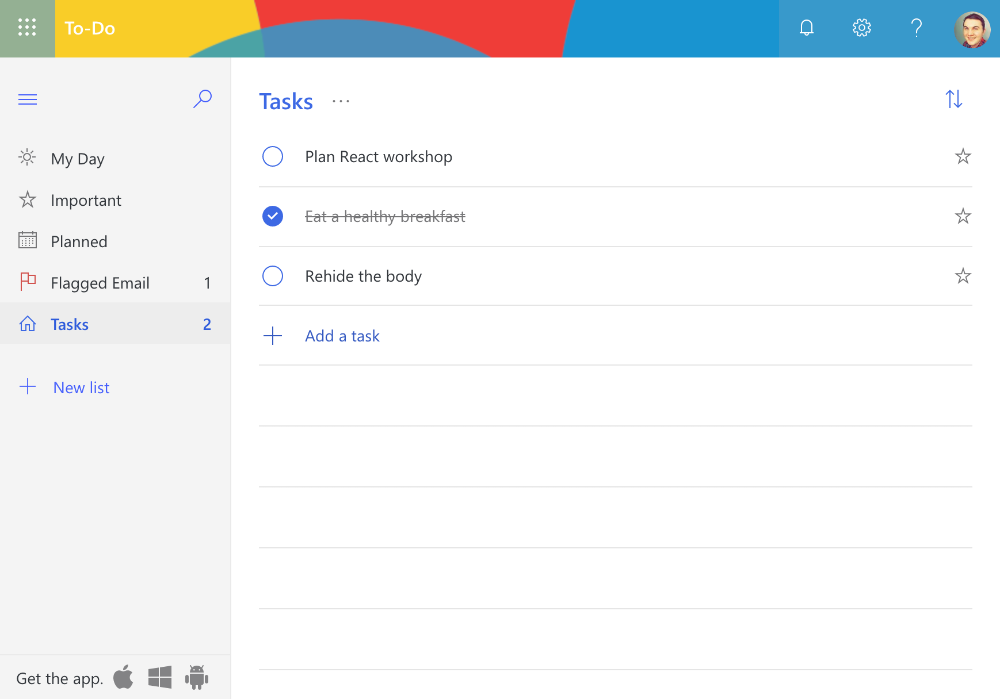

import { Appear, Notes, Image } from 'mdx-deck'
import { dark as darkTheme } from 'mdx-deck/themes'
import Syntax from './components/Syntax'
import theme from './theme'
import { Split } from 'mdx-deck/layouts'
import Hi from './components/Highlight'
import SVG from './components/SVG'
import AppearSplit from './components/AppearSplit'
import SplitCode from './components/SplitCode'
import FullsizeSandbox from './components/FullsizeSandbox'
import vsDark from "./surfTheme";
import { CodeSurferColumnLayout, Step, Code } from "code-surfer";
import Big from './components/LargeTitle'

export const themes = [darkTheme, Syntax, vsDark, theme]

import SplashScreen from './components/SplashScreen'
import ShapesBG from './components/ShapesBG'

<SplashScreen />

---

---

<Notes> As web pages become more dynamic, interactive, and complex, several commmon problems arise</Notes>

# Modern web users expect web pages to be <Hi>feature-rich</Hi>, <Hi>fast</Hi>, and <Hi>highly dynamic</Hi>

---

# As web apps get more complicated, common problems arise:

---

## How do I reuse my code?

<Appear>

## How do I efficiently update the DOM?
## How do I keep track of the "state" of my app?

</Appear>

---

import HistorySlide from './components/HistorySlide'

<Notes>Facebook recognized these problems, and invented React to use in their own sites.</Notes>

<HistorySlide />

---

# React is a <Hi>declarative</Hi> Javascript framework for building <Hi>user interfaces</Hi>.

---

<Notes>React makes it easy to keep your site in sync</Notes>

# Automatic DOM updates (<Hi>virtual DOM</Hi>)

<Appear>

# Reusable code (<Hi>components</Hi>)
# Declarative syntax (<Hi>JSX</Hi>)

</Appear>

---

<Notes>Let's look at a simple web app, Microsoft ToDo</Notes>

---

# A simple app like this has <Hi>a lot</Hi> of possible <Hi>states</Hi>

---

---

<Notes>119 septendecillion possible permutations of this site.</Notes>

## How many <Hi>possible states</Hi>?

## With at least <Hi>45</Hi> state attributes, there are:

119,622,220,865,480,000,000,000,000,000,000,000,000,000,000,000,000,000,000

## possible permuations of Microsoft ToDo

---

## That's an <Hi>impossible</Hi> number of states to account for using <Hi>traditional methods</Hi>

---

# How does <Hi>React</Hi> help solve this problem?

<SplashScreen noText />

---

<Notes>It starts with the concept of PURE FUNCTIONS</Notes>

<Big style={{transform: 'translateY(15%)'}}>Pure Functions</Big>

<ShapesBG />

---

<CodeSurferColumnLayout sizes={[1]}>
  <Step>
    <Code
      code={require("!!raw-loader!./code/pure.1.0.js").default}
      lang="js"
    />
  </Step>
  <Step>
    <Code
      code={require("!!raw-loader!./code/pure.1.1.js").default}
      lang="js"
      focus="1:5"
    />
  </Step>
  <Step>
    <Code
      code={require("!!raw-loader!./code/pure.1.2.js").default}
      lang="js"
      focus="1:12"
    />
  </Step>
</CodeSurferColumnLayout>

---

# In React, your UI is a <Hi>pure function</Hi> of the <Hi>state</Hi> of your application

---

import PureFunctions from './examples/PureFunctions'

<CodeSurferColumnLayout sizes={[2, 1]}>
  <Step>
    <Code
      code={require("!!raw-loader!./code/state.1.0.js").default}
      lang="json"
    />
    <PureFunctions todos={[
      {text: "Hide the body", done: false},
      {text: "Blackmail the witnesses", done: true},
      {text: "Buy a new toaster", done: false}
    ]} />
  </Step>
  <Step>
    <Code
      code={require("!!raw-loader!./code/state.1.1.js").default}
      lang="json"
      focus="1:7"
    />
    <PureFunctions todos={[
      {text: "Hide the body", done: false},
      {text: "Blackmail the witnesses", done: true},
      {text: "Buy a new toaster", done: false},
      {text: "Practice alibi", done: false}
    ]} />
  </Step>
  <Step>
    <Code
      code={require("!!raw-loader!./code/state.1.2.js").default}
      lang="json"
      focus="1:8"
    />
    <PureFunctions todos={[
      {text: "Hide the body", done: false},
      {text: "Blackmail the witnesses", done: true},
      {text: "Buy a new toaster", done: true},
      {text: "Practice alibi", done: true}
    ]} />
  </Step>
</CodeSurferColumnLayout>

---

# Your web app "<Hi>Reacts</Hi>" to changes in your state

<Appear>

# This happens <Hi>automatically</Hi> because of the...

</Appear>

---

<Big style={{transform: 'translateY(15%)'}}>Virtual DOM</Big>

<ShapesBG />

---

import VDomBackground from './components/VDomBackground'

<CodeSurferColumnLayout sizes={[2, 2, 1]}>
  <Step>
    <Code
      code={require("!!raw-loader!./code/vdom.1.0.html").default}
      lang="html"
    />
    <Code
      code={require("!!raw-loader!./code/vdom.1.0.html").default}
      lang="html"
    />
    <PureFunctions
    small
    todos={[
      {text: "Hide the body", done: false},
      {text: "Blackmail the witnesses", done: true},
      {text: "Buy a new toaster", done: false}
    ]} />
  </Step>
  <Step>
    <Code
      code={require("!!raw-loader!./code/vdom.1.1.html").default}
      lang="html"
      focus="1:18"
    />
    <Code
      code={require("!!raw-loader!./code/vdom.1.0.html").default}
      lang="html"
      focus="1:14"
    />
    <PureFunctions
    small
    todos={[
      {text: "Hide the body", done: false},
      {text: "Blackmail the witnesses", done: true},
      {text: "Buy a new toaster", done: false}
    ]} />
  </Step>
  <Step>
    <Code
      code={require("!!raw-loader!./code/vdom.1.1.html").default}
      lang="html"
      focus="1:18"
    />
    <Code
      code={require("!!raw-loader!./code/vdom.1.1.html").default}
      lang="html"
      focus="1:18"
    />
    <PureFunctions
    small
    todos={[
      {text: "Hide the body", done: false},
      {text: "Blackmail the witnesses", done: true},
      {text: "Buy a new toaster", done: false},
      {text: "Practice alibi", done: false}
    ]} />
  </Step>
  <Step>
    <Code
      code={require("!!raw-loader!./code/vdom.1.2.html").default}
      lang="html"
      focus="1:18"
    />
    <Code
      code={require("!!raw-loader!./code/vdom.1.1.html").default}
      lang="html"
      focus="1:18"
    />
    <PureFunctions
    small
    todos={[
      {text: "Hide the body", done: false},
      {text: "Blackmail the witnesses", done: true},
      {text: "Buy a new toaster", done: false},
      {text: "Practice alibi", done: false}
    ]} />
  </Step>
  <Step>
    <Code
      code={require("!!raw-loader!./code/vdom.1.2.html").default}
      lang="html"
      focus="1:18"
    />
    <Code
      code={require("!!raw-loader!./code/vdom.1.2.html").default}
      lang="html"
      focus="1:18"
    />
    <PureFunctions
    small
    todos={[
      {text: "Hide the body", done: false},
      {text: "Blackmail the witnesses", done: true},
      {text: "Buy a new toaster", done: true},
      {text: "Practice alibi", done: true}
    ]} />
  </Step>
</CodeSurferColumnLayout>

<VDomBackground />

---

# Let's jump into some real code

<ShapesBG />

---

<FullsizeSandbox>
  <iframe
    src="https://codesandbox.io/embed/restless-cherry-o73ru?fontsize=24&hidenavigation=1"
    title="hooks-demo"
    allow="geolocation; microphone; camera; midi; vr; accelerometer; gyroscope; payment; ambient-light-sensor; encrypted-media"
    sandbox="allow-modals allow-forms allow-popups allow-scripts allow-same-origin">
  </iframe>
</FullsizeSandbox>

---

<Big>Let's build an app</Big>

<ShapesBG />
